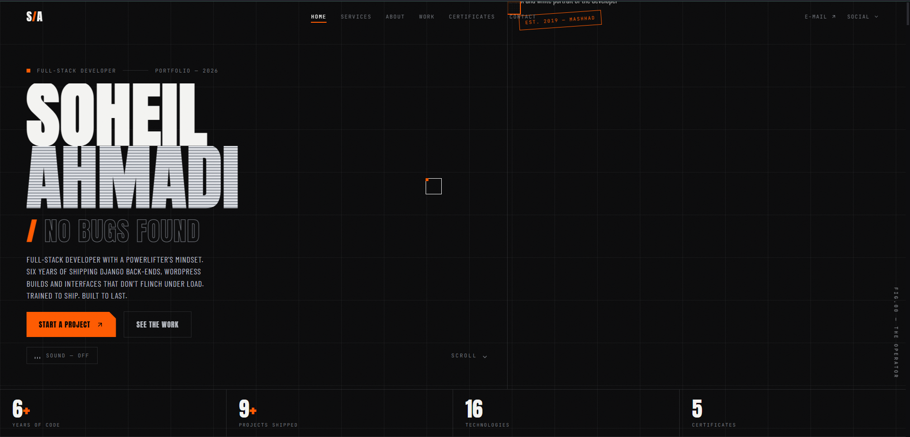

# Soheil Ahmadi — Portfolio

A high-performance, single-page portfolio for a full-stack developer. Built with semantic HTML, modern CSS, and vanilla JavaScript. Designed to feel like a club identity: pure black, neon orange, and metallic silver.



## Features

- **Single-page architecture** — smooth scrolling sections with scroll-driven reveals
- **Custom cursor** — orange dot + trailing ring with hover states
- **Scroll-driven METHOD section** — sticky stage that changes as you scroll
- **Marquee tickers** — animated text bands for emphasis
- **Mouse-follow preview card** — hover over work items to preview projects
- **Certificate gallery** — sticky preview with hover and modal view
- **Sound toggle** — optional ambient audio using Web Audio API
- **Fully responsive** — mobile-first with dedicated full-screen menu
- **Django-ready data injection** — replace `SITE_DATA` with JSON from Django

## Tech Stack

- **HTML5** — semantic markup
- **CSS** — custom properties, clamp(), grid, animations
- **JavaScript (ES6+)** — IntersectionObserver, requestAnimationFrame, Web Audio
- **Lucide Icons** — lightweight icon library

## Project Structure

```
portfolio-v3/
├── index.html
├── css/
│   └── style.css
├── js/
│   └── script.js
├── README.md
└── LICENSE
```

## Getting Started

1. Clone the repository:
   ```bash
   git clone https://github.com/soheil-ahmadi/portfolio-v3.git
   ```

2. Open `index.html` in your browser. No build step required.

3. Customize content in `js/script.js` → `SITE_DATA`.

## Customization

- **Colors**: edit CSS custom properties in `css/style.css` under `:root`
- **Content**: update `SITE_DATA` in `js/script.js`
- **Fonts**: replace Google Fonts links in `index.html`
- **Audio**: set `hero_audio` in `SITE_DATA` to an audio file URL

## License

MIT License — feel free to use this template for your own portfolio.

## Contact

Soheil Ahmadi — [@soheil-ahmadi](https://github.com/soheil-ahmadi)
